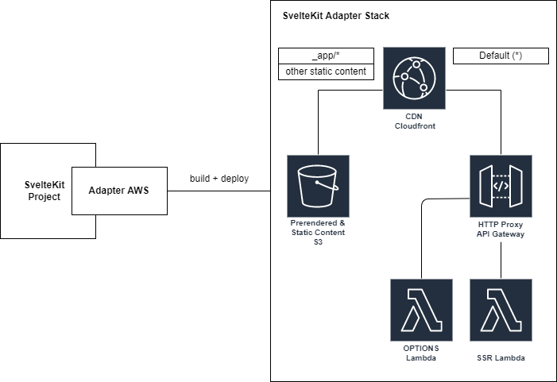

[](https://www.npmjs.com/package/sveltekit-adapter-aws-base)

[](https://github.com/Data-Only-Greater/sveltekit-adapter-aws-base/actions/workflows/unit_tests.yml)
[](https://github.com/Data-Only-Greater/sveltekit-adapter-aws-base/actions/workflows/release.yml)

[](https://codecov.io/github/Data-Only-Greater/sveltekit-adapter-aws-base)

# SvelteKit AWS Adapter Base Package

This project is the base package for SvelteKit adapters which deploy SvelteKit
to AWS using various IAC providers.

## Installation

```
$ npm install sveltekit-adapter-aws-base
```

## How to use?

This package is not intended for end-user usage. Please use one of the
consumers of this package in the [example IAC providers](#Examples) section.

For developers of AWS SvelteKit adapters that wish to implement a new IAC
solution, this package provides the following function:

<a name="_default"></a>

### \_default(builder, artifactPath, esbuildOptions) ⇒ [<code>Promise.&lt;SiteProps&gt;</code>](#SiteProps)

<p>Prepare SvelteKit files for deployment to AWS services</p>

**Kind**: global function

| Param          | Type                | Default                        | Description                                                                                            |
| -------------- | ------------------- | ------------------------------ | ------------------------------------------------------------------------------------------------------ |
| builder        | <code>any</code>    |                                | <p>The SvelteKit provided [Builder](https://kit.svelte.dev/docs/types#public-types-builder) object</p> |
| artifactPath   | <code>string</code> | <code>&quot;build&quot;</code> | <p>The path where to place to SvelteKit files</p>                                                      |
| esbuildOptions | <code>any</code>    |                                | <p>Options to pass to esbuild</p>                                                                      |

<a name="SiteProps"></a>

### SiteProps : <code>Object</code>

**Kind**: global typedef  
**Properties**

| Name                  | Type                              | Description                                   |
| --------------------- | --------------------------------- | --------------------------------------------- |
| server_directory      | <code>string</code>               | <p>location of files for the SSR server</p>   |
| static_directory      | <code>string</code>               | <p>location of static page files</p>          |
| prerendered_directory | <code>string</code>               | <p>location of prerendered page files</p>     |
| routes                | <code>Array.&lt;string&gt;</code> | <p>routes to static and prerendered pages</p> |

The function above should be used within a [SvelteKit adapter
function](https://kit.svelte.dev/docs/writing-adapters); for example:

```ts
import prepAdapter from 'sveltekit-adapter-aws-base'

export default function ({
  artifactPath = 'build',
  esbuildOptions = {},
  // More options
} = {}) {
  /** @type {import('@sveltejs/kit').Adapter} */
  const adapter = {
    name: 'adapter-aws-myiacprovider',
    async adapt(builder) {
      const {
        server_directory,
        static_directory,
        prerendered_directory,
        routes,
      } = await prepAdapter(builder, artifactPath, esbuildOptions)
      // More code
    },
  }

  return adapter
}
```

## Reference architecture

The following diagram shows a reference architecture for deploying the files
generated by this package. The key features are as follows:

1. A CloudFront CDN
1. An S3 bucket to serve prerendered and static content (via the CloudFront
   CDN)
1. An APIGateWay HTTP API with two routes:
   1. The default route is integrated with a lambda that serves the SSR code
   2. A second route for OPTIONS requests that integrates with a lambda used
      to manage CORS



<a name="Examples"></a>

## Example IAC providers

- [Pulumi](https://github.com/Data-Only-Greater/sveltekit-adapter-aws-pulumi)

## Credits

This package is derived from [Mike
Bild's](https://github.com/MikeBild/sveltekit-adapter-aws) AWS adapter for CDK.
