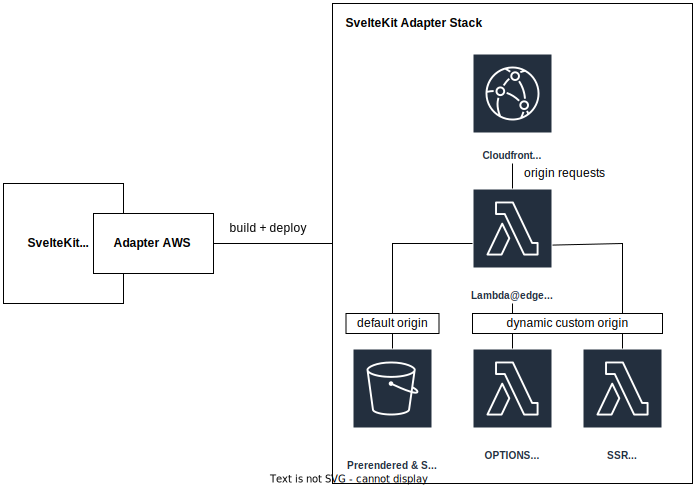

[](https://www.npmjs.com/package/sveltekit-adapter-aws-base)


[](https://github.com/Data-Only-Greater/sveltekit-adapter-aws-base/actions/workflows/unit_tests.yml)
[](https://github.com/Data-Only-Greater/sveltekit-adapter-aws-base/actions/workflows/release.yml)

[](https://app.codecov.io/github/Data-Only-Greater/sveltekit-adapter-aws-base)

# SvelteKit AWS Adapter Base Package

This project is for the use of SvelteKit adapters which deploy to AWS using
various IAC providers. It provides functions common to a reference AWS
architecture.

The project is in development and is seeking collaborators to develop
implementations for IAC providers. See the [examples](#Examples) section for
the IAC providers that are currently supported. Please feel free to open an
issue if you would like to discuss using or developing this package.

## Installation

```
$ npm install sveltekit-adapter-aws-base
```

## How to use?

This package is not intended for end-user usage. Please use one of the
consumers of this package in the [example IAC providers](#Examples) section.

For developers of AWS SvelteKit adapters that wish to implement a new IAC
solution, this package provides functions for implementing the following
reference architecture:



The lambda@edge function handles origin requests from a Cloudfront CDN that has
a default S3 origin for static files and two lambda function URLs for the SSR
server and an OPTIONS request handler (for preflight CORS checks). The router
signs requests to the lambda URLs, thus they can be configured to use AWS_IAM
authentication. If the S3 origin is also secured with OAC, then all origins
will only be accessible through the CDN.

The functions provided by this package implement the SSR server, options
handler and lambda@edge router. They are defined as follows:

<dl>
<dt><a href="#buildServer">buildServer(builder, artifactPath, esbuildOptions)</a> ⇒ <code><a href="#SiteProps">Promise.&lt;SiteProps&gt;</a></code></dt>
<dd><p>Prepare SvelteKit SSR server files for deployment to AWS services</p></dd>
<dt><a href="#buildOptions">buildOptions(builder, artifactPath)</a> ⇒ <code>Promise.&lt;string&gt;</code></dt>
<dd><p>Prepare options handler for deployment to AWS services</p></dd>
<dt><a href="#buildRouter">buildRouter(builder, static_directory, prerendered_directory, serverURL, optionsURL, artifactPath)</a> ⇒ <code>Promise.&lt;string&gt;</code></dt>
<dd><p>Prepare lambda@edge origin router for deployment to AWS services</p></dd>
</dl>

<a name="buildServer"></a>

### buildServer(builder, artifactPath, esbuildOptions) ⇒ [<code>Promise.&lt;SiteProps&gt;</code>](#SiteProps)

<p>Prepare SvelteKit SSR server files for deployment to AWS services.</p>
<p>To determine the URL request origin the server uses the following hierarchy:</p>
<ul>
<li>The ORIGIN environment variable</li>
<li>The value of the 'X-Forwarded-Host' header</li>
<li>The domain name within the request event</li>
</ul>
<p>The origin value is important to prevent CORS errors.</p>

**Kind**: global function

| Param          | Type                 | Default                        | Description                                                                                            |
| -------------- | -------------------- | ------------------------------ | ------------------------------------------------------------------------------------------------------ |
| builder        | <code>any</code>     |                                | <p>The SvelteKit provided [Builder](https://kit.svelte.dev/docs/types#public-types-builder) object</p> |
| artifactPath   | <code>string</code>  | <code>&quot;build&quot;</code> | <p>The path where to place to SvelteKit files</p>                                                      |
| esbuildOptions | <code>any</code>     |                                | <p>Options to pass to esbuild</p>                                                                      |
| streaming      | <code>boolean</code> | <code>false</code>             | <p>Use Lambda response streaming</p>                                                                   |

<a name="buildOptions"></a>

### buildOptions(builder, artifactPath) ⇒ <code>Promise.&lt;string&gt;</code>

<p>Prepare options handler for deployment to AWS services</p>

**Kind**: global function  
**Returns**: <code>Promise.&lt;string&gt;</code> - Location of files for the options handler

| Param        | Type                | Default                        | Description                                                                                            |
| ------------ | ------------------- | ------------------------------ | ------------------------------------------------------------------------------------------------------ |
| builder      | <code>any</code>    |                                | <p>The SvelteKit provided [Builder](https://kit.svelte.dev/docs/types#public-types-builder) object</p> |
| artifactPath | <code>string</code> | <code>&quot;build&quot;</code> | <p>The path where to place to SvelteKit files</p>                                                      |

<a name="buildRouter"></a>

### buildRouter(builder, static_directory, prerendered_directory, serverURL, optionsURL, artifactPath) ⇒ <code>Promise.&lt;string&gt;</code>

<p>Prepare lambda@edge origin router for deployment to AWS services</p>
<p>Note that this function will forward the original Host header as
'X-Forwarded-Host' to the lambda URLs.</p>

**Kind**: global function  
**Returns**: <code>Promise.&lt;string&gt;</code> - Location of files for the origin router

| Param                 | Type                | Default                        | Description                                                                                            |
| --------------------- | ------------------- | ------------------------------ | ------------------------------------------------------------------------------------------------------ |
| builder               | <code>any</code>    |                                | <p>The SvelteKit provided [Builder](https://kit.svelte.dev/docs/types#public-types-builder) object</p> |
| static_directory      | <code>string</code> |                                | <p>location of static page files</p>                                                                   |
| prerendered_directory | <code>string</code> |                                | <p>location of prerendered page files</p>                                                              |
| serverURL             | <code>string</code> |                                | <p>function URL for the server lambda</p>                                                              |
| optionsURL            | <code>string</code> |                                | <p>function URL for the options handler lambda</p>                                                     |
| artifactPath          | <code>string</code> | <code>&quot;build&quot;</code> | <p>The path where to place to SvelteKit files</p>                                                      |

<a name="SiteProps"></a>

### SiteProps : <code>Object</code>

**Kind**: global typedef  
**Properties**

| Name                  | Type                | Description                                 |
| --------------------- | ------------------- | ------------------------------------------- |
| server_directory      | <code>string</code> | <p>location of files for the SSR server</p> |
| static_directory      | <code>string</code> | <p>location of static page files</p>        |
| prerendered_directory | <code>string</code> | <p>location of prerendered page files</p>   |

The functions above should be used within a [SvelteKit adapter
function](https://kit.svelte.dev/docs/writing-adapters); for example:

```ts
import {
  buildServer,
  buildOptions,
  buildRouter,
} from 'sveltekit-adapter-aws-base'

export default function ({
  artifactPath = 'build',
  esbuildOptions = {},
  // More options
} = {}) {
  /** @type {import('@sveltejs/kit').Adapter} */
  const adapter = {
    name: 'adapter-aws-myiacprovider',
    async adapt(builder) {
      const { serverDirectory, staticDirectory, prerenderedDirectory } =
        await buildServer(builder, artifactPath, esbuildOptions)
      const optionsDirectory = await buildOptions(builder, artifactPath)

      // Deploy server to lambda and get domain name of URL. These can use
      // AWS_IAM AuthType, as the router will sign requests.
      const serverDomain = getLambdaURLDomain(server_directory)
      const optionsDomain = getLambdaURLDomain(server_directory)

      const edgeDirectory = await buildRouter(
        builder,
        staticDirectory,
        prerenderedDirectory,
        serverDomain,
        optionsDomain,
        artifactPath
      )

      // Deploy router to lambda and get its arn
      const routerArn = getLambdaArn(edgeDirectory)

      // Upload static files to S3
      const myBucket = deployS3(staticDirectory, prerenderedDirectory)

      // Deploy a CloudFront CDN with the S3 bucket as the default origin
      // (with OAC for added security) and the lambda@edge function to handle
      // origin-requests.
      const CDN = deployCDN({
        defaultOriginBucket: myBucket,
        defaultCacheBehaviourOriginRequestHandler: routerArn,
      })
    },
  }

  return adapter
}
```

<a name="Examples"></a>

## Example IAC providers

- [Pulumi](https://github.com/Data-Only-Greater/sveltekit-adapter-aws-pulumi)

## Credits

This package is derived from [Mike
Bild's](https://github.com/MikeBild/sveltekit-adapter-aws) adapter for CDK
and [James Bray's](https://github.com/yarbsemaj/sveltekit-adapter-lambda)
adapter for Serverless Framework.
